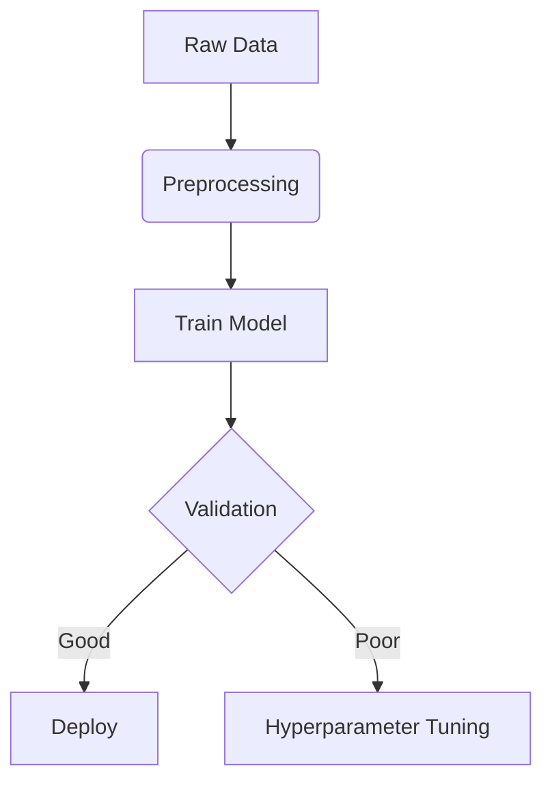

# Experiment: [Focus Training] - 20250606

**Status:** ✅ Completed `<!-- / ⏳ Running / ❌ Failed -->`

## 1. Metadata
- **ID:** `FOCUS-EXP-20250606-00` (Unique identifier)
- **Author:** xxraincandyxx
- **Creation Date:** 2025-06-06
- **Last Updated:** 2025-06-06

## 2. Objective

Init training with Focus Model, Classification task, on Dataset NEU-CLS.

## 3. Model Architecture

- **Type:** Focus
- **Diagram:** FAKE



- **Code Reference:** `models/module.py#L23` (link to code)

## 4. Hyperparameters

| Parameter     | Value        |
| ------------- | ------------ |
| Learning Rate | 1e-3         |
| Batch Size    | 16/32        |
| Epochs        | 50-100+      |
| Optimizer     | AdamW        |
| Loss Function | CrossEntropy |

---

| Model Attributes | Description |
| ---------------- | ----------- |
| Number of Params | 339957      |
| Size of Weights  | ~5.72Mb     |

## 5. Dataset

- **Source:** [Kaggle](https://www.kaggle.com/dataset) ← Fake (Placeholder)
- **Preprocessing:**

  ```python
  # Fake (Placeholder)
  transform = Compose([Resize(256), ToTensor()])
  ```
- **Splits:**
  Train and Test are separated different dirs.

  - Train: 100%
  - Validation: 0%
  - Test: 100%

## 6. Training Logs

### Key Metrics (Final)

Fake placeholders, please refer to the **Results & Analysis** for what you wanna know.

| Split | Accuracy | Loss |
| ----- | -------- | ---- |
| Train | 0.92     | 0.21 |
| Test  | 0.87     | 0.45 |

### Charts (Attach images)

<!--  -->

Should be a `loss_curve` here as placeholder.

## 7. Environment

- **Hardware:** Titan V (11GB)
- **Software:**

```bash
  Python=3.12.9
  torch=2.2.2
  ...
```

## 8. Results & Analysis

The loss dropped fluently at start, then about 10 epochs later, when the loss is roughly around 0.2, the process became not that fluent and the curve thus became zigzag. And we observed some interesting facts.

About 50 epochs, we got a model with a train loss low at around 0.06-0.08, and tested it with the test dataset. And of course the with the four times check, the final `focus_window` could actually move to somewhere that seems important (currently we only observed the final position of `focus_window`). The final test accuracy on the dataset could reach over 85%.

Overfitting observed after epoch 50 → From this time on the loss of the model on training dataset cannot drop down lower than 0.06. We suggest that the fixed learning rate as `1e-3` might be a cause, and that via the test using a model of about 90-epochs we observed that the position of last `focus_window` became fixed to the a near-left-bottom position, even with a lower loss than the the one we mentioned above. And beyond doubt this is absolutely overfitting.

---

How to avoid the above problems? We currently suggest the following solutions:

- for the influent training, we guess there's a vanishing gradients during the training session for our simple iterating over the focus logic. Thereby we may need something implemented, e.g. the *skip connection*.
- for the fixed `focus_window`, we are currently working on it. We suggest that this phenomenon happens similarly for the *MoE (Mixture of Experts) Mechanism*, thus we may refer to, e.g., the *DeepSeek MoE* for help / guide, to, somehow, motivate the moving window feature.

## 9. Reproducibility

```
Not Available
```

## 10. References

All fake as placeholders

- [Paper](https://arxiv.org/abs/1234.5678)
- [Baseline Experiment](./EXP-20240601-01.md)

## Changelogs

- None
