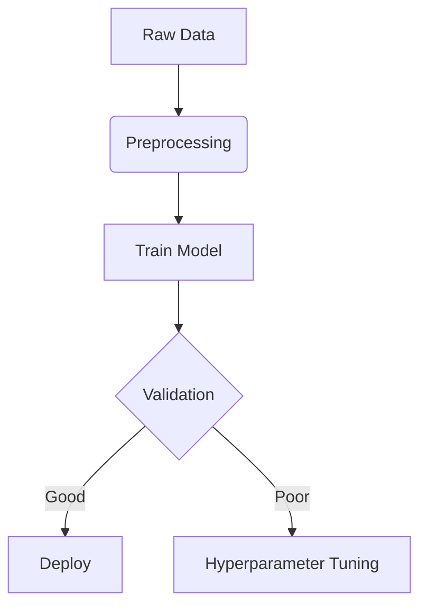

# Experiment: [Focus Training] - 20250608

**Status:** ✅ Completed `<!-- / ⏳ Running / ❌ Failed -->`

---

Preliminary: This note/log is just inherited from the previous one, as for the template, so what makes sense would be put mainly in the *Results and Analysis* session.

---

## 1. Metadata

- **ID:** `FOCUS-EXP-20250606-00` (Unique identifier)
- **Author:** xxraincandyxx
- **Creation Date:** 2025-06-06
- **Last Updated:** 2025-06-06

## 2. Objective

Init training with Focus Model, Classification task, on Dataset NEU-CLS.

## 3. Model Architecture

- **Type:** Focus
- **Diagram:** FAKE



- **Code Reference:** `models/module.py#L23` (link to code)

## 4. Hyperparameters

| Parameter     | Value        |
| ------------- | ------------ |
| Learning Rate | 1e-3         |
| Batch Size    | 16/32        |
| Epochs        | 50-100+      |
| Optimizer     | AdamW        |
| Loss Function | CrossEntropy |

---

| Model Attributes | Description |
| ---------------- | ----------- |
| Number of Params | 339957      |
| Size of Weights  | ~5.72Mb     |

---

| Parameter     | Value        |
| ------------- | ------------ |
| Learning Rate | 1e-5         |
| Batch Size    | 16/32        |
| Epochs        | 50-100+      |
| Optimizer     | AdamW        |
| Loss Function | CrossEntropy |

---

| Model Attributes | Description |
| ---------------- | ----------- |
| Number of Params | 2040249     |
| Size of Weights  | ~????Mb     |

## 5. Dataset

- **Source:** [Kaggle](https://www.kaggle.com/dataset) ← Fake (Placeholder)
- **Preprocessing:**

  ```python
  # Fake (Placeholder)
  transform = Compose([Resize(256), ToTensor()])
  ```
- **Splits:**
  Train and Test are separated different dirs.

  - Train: 90%
  - Validation: 10%
  - Test: 100%

## 6. Training Logs

### Key Metrics (Final)

Fake placeholders, please refer to the **Results & Analysis** for what you wanna know.

| Split | Accuracy | Loss |
| ----- | -------- | ---- |
| Train | 0.92     | 0.21 |
| Test  | 0.87     | 0.45 |

### Charts (Attach images)

<!--  -->

Should be a `loss_curve` here as placeholder.

## 7. Environment

- **Hardware:** Titan V (11GB)
- **Software:**

```bash
  Python=3.12.9
  torch=2.2.2
  ...
```

## 8. Results & Analysis

The relatively small size of the model, of mode `debug`, has extraordinary results, which, even surpassed my expectation.

I cannot remember clearly the full details but I'll list some of the results. The really amazing one is the "aha" moment in epoch 67.

I interrupted the training loop when the epoch reaches 91, because I suppose that the model has "understand" the classification logic and continuing training won't do any help though, considering the logging metric for my training process is the `valid`, thus the on-training process would just keep finding a lower value of the valid loss, which could somehow, make the model's test loss higher -- this is absolutely not what we expect.

| Epoch | Train | Valid | Test  |
| ----- | ----- | ----- | ----- |
| 36    | 0.05  | 0.11  | 0.18  |
| 67    | 0.016 | 0.085 | 0.034 |
| 91    | 0.060 | 0.053 | 0.073 |

However, for the larger model, of mode `light`, it has been a weird hollow void...I tried to decrease the learning rate and have experimented with it for several trials, yet its loss just cannot drop down fluently as the `debug` model, even worse for the test loss.

There must be something wrong, I'm still confusing and still working on it, thx.

I have my preliminary assumptions that this phenomenon is caused by the `batch_size`, I will check it later.

(Added 06-10-25) Whatever I tried, including the `warmup`, `learning rate scheduler`, `batch_size`, etc.. The light-mode model, just cannot reach something the 'aha' moment... This is strange -- we suppose that it is caused by the learning, which is to fast that the focusing mechanism somehow got stuck -- which made the focus window not that responsive to enable our model to dynamically find the objects and reach our expectation.

So our next step would be the RL, the *Loading Balance* mechanism -- which is inspired by *DeepSeekV3*'s model training design.

## 9. Reproducibility

```
Not Available
```

## 10. References

All fake as placeholders

- [Paper](https://arxiv.org/abs/1234.5678)
- [Baseline Experiment](./EXP-20240601-01.md)

## Changelogs

- (06-10-25) Add Experiments & Analysis
